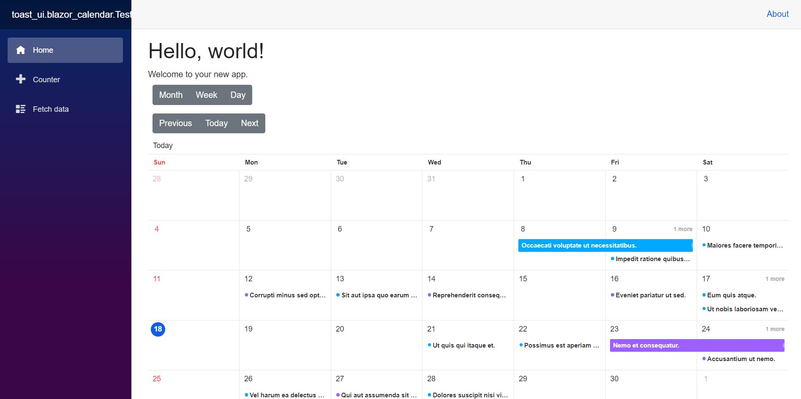

## toast_ui.blazor_calendar
A Toast UI Calendar Wrapper For Blazor  
Drag-And-Drop Events, Tasks, and Scheduling  


---


See Toast UI Calendar for details:
https://github.com/nhn/tui.calendar  
Toast UI Calendar Site:
https://ui.toast.com/tui-calendar


### Pre-Release BETA now available on Nuget.

## Please visit Disucssions for any questions or comments or open an issue for any bugs found.

## How to start:

####
Nuget Pre-release:  
`Install-Package toast_ui.blazor_calendar -Version 1.0.0-beta2.2`

### Edit your project files:
#### In `_Imports.razor` 
add: 
```c#
@using toast_ui.blazor_calendar
```

#### In `_Host.cshtml` 
add this inside the `<head>` 
```html
<link href="_content/toast_ui.blazor_calendar/TUI.blazorCalendar.css" rel="stylesheet">
```

add this inside the `<body>` near the bottom 
```html
<script src="_content/toast_ui.blazor_calendar/TUI.blazor_calendar.min.js"></script> 
```

#### Place the Component in a razor file (See Test Project)
```razor
<TUICalendar Schedules="ViewModel.Schedules" 
             CalendarOptions="ViewModel.CalendarOptions" 
             CalendarProperties="ViewModel.CalendarProps"
             CalendarViewName="ViewModel.CalendarViewName"
             @bind-VisibleStartDateRange="ViewModel.StartDate"
             @bind-VisibleEndDateRange="ViewModel.EndDate"
             OnChangeCalendarEventOrTask="@(async (x) => await ViewModel.OnChangeCalendarEventOrTask(x))"
             OnClickCalendarEventOrTask="@(async (x) => await ViewModel.OnClickCalendarEventOrTask(x))"
             OnCreateCalendarEventOrTask="@(async (x) => await ViewModel.OnCreateCalendarEventOrTask(x))"
             OnDeleteCalendarEventOrTask="@(async (x) => await ViewModel.OnDeleteCalendarEventOrTask(x))"
             @ref=_calendarRef></TUICalendar>
```

### Contributing
Create and/or make a pull request on the `dev` branch.


### WAAAYYY More To Come... Help Welcomed

I am attempting to implement a simple CalDav Server and Client to make a better example of the calendar component.
[CalDavSharp](https://github.com/gismofx/CalDavSharp)
